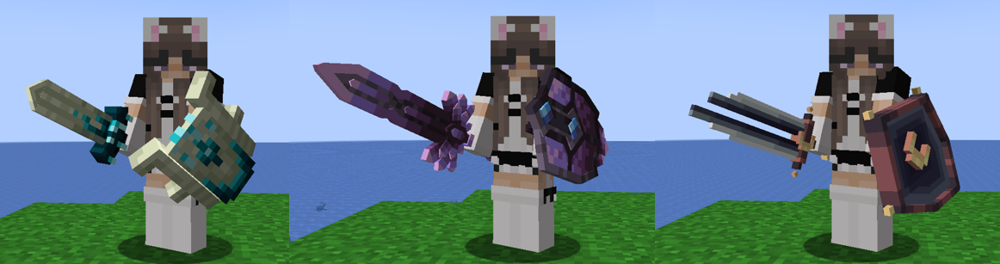

# Skins


In-Game Command: **/skins**


### What are Skins?

One of our features here on CYT is Skins. These you can apply to your tools to make them look extra fancy! You can type /skins in game to see our current catalogue of Skins and where to obtain them!

You apply Skins by dragging the respective Skin onto your tool, and they can only be applied to Diamond or Netherite tools, so for instance, you would need a Pickaxe Skin to apply it to your Diamond Pickaxe!

If you wish to remove a Skin from a tool, you would need a Skin remover, which is a one-time use item and can be found by the Item NPC at the Trading Hall at /warp Trading!

<figure><figcaption></figcaption></figure>
