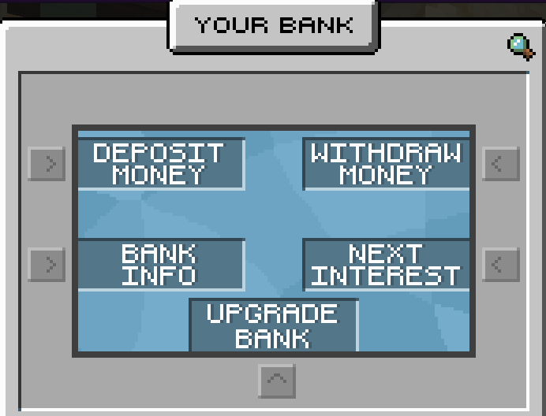

# Bank


In-Game Command: **/warp bank** or **/bank** (unlocked at Rank VI)


### **What is the Bank?**

A bank is a place for you to store cash separate from Town/Nation banks and unique to your account. Nobody else can access it.

### **How do I view my Bank balance?**

Your bank balance is shown on your scoreboard and by hovering over **Bank Info** in the Bank GUI

### **Is there any minimum deposit/withdrawal amount?**

There are no minimums.

### **Can you upgrade your bank limits?**

**Yes!** If you hover over the **Upgrade Bank** in the GUI you'll see the upgrade. You can then click to upgrade, you need to have the money to purchase the upgrade in your bank, not your cash.



<table><thead><tr><th width="157.33333333333331">Tier</th><th>Cost</th><th>Capacity</th><th>Interest Rate</th><th>Interest Time</th></tr></thead><tbody><tr><td>Free</td><td>N/A</td><td>£25,000</td><td>0.3%</td><td>24 hours</td></tr><tr><td>Basic</td><td>£5,000</td><td>£50,000</td><td>0.3%</td><td>24 hours</td></tr><tr><td>Premium</td><td>£10,000</td><td>£100,000</td><td>0.35%</td><td>24 hours</td></tr><tr><td>Gold</td><td>£25,000</td><td>£250,000</td><td>0.35%</td><td>24 hours</td></tr><tr><td>Platinum</td><td>£50,000</td><td>£500,000</td><td>0.40%</td><td>24 hours</td></tr><tr><td>Diamond</td><td>£100,000</td><td>£1,000,000</td><td>0.40%</td><td>24 hours</td></tr><tr><td>Executive</td><td>£250,000</td><td>£2,500,000</td><td>0.45%</td><td>24 hours</td></tr><tr><td>Executive+</td><td>£500,000</td><td>£5,000,000</td><td>0.50%</td><td>24 hours</td></tr><tr><td>Ultimate</td><td>£1,000,000</td><td>£10,000,000</td><td>0.50%</td><td>24 hours</td></tr></tbody></table>



### Bank Gui:

<figure><figcaption></figcaption></figure>
