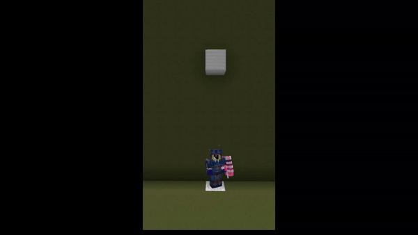

# Elevators

### **What are Elevators?**

Are you tired of using ladders or stairs to get up and down? Worry no more! One of the features of CYT is Elevators! They are very simple to use; place an iron block on one floor, and place an iron block in the same position on another floor, and there you have it! You can place as many iron blocks as you’d like, as long as they’re on top of each other, they will work!

<figure><figcaption>
An elevator in use
</figcaption></figure>
