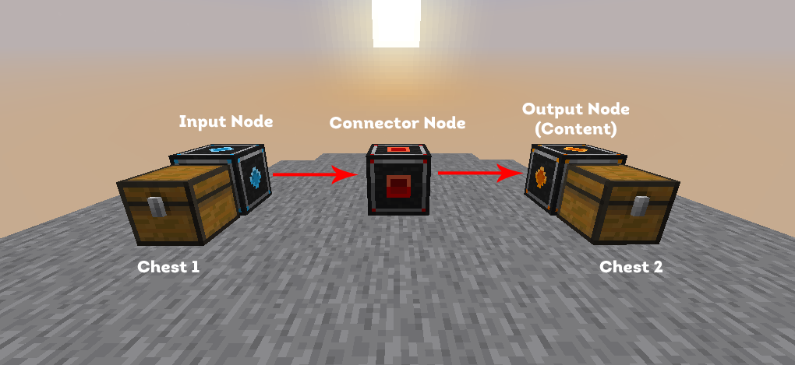

# Logistics (CYG)

Logistics is our custom mass item transportation system which can help with storage and automation.

For an in-game tutorial, we recommend **/pw nodes** by player PiousDuty (available on Towny only).

Available Items

* **Storage**
  * **Big Barrel** - Stores 256 stacks of a singular item
  * **Large Barrel** - Stores 512 stacks of a singular item
  * **Deep Storage Unit** - Stores 16384 stacks of a singular item
* **Nodes**
  * **Input Node -** The starting building block of any node network. Allows the extraction of items from nearby containers at the rate of Stack/5s whilst conforming to given filters. (must be placed adjacent to an input container (Chests, Barrels, Furnaces, CYG Barrels, CYG Machines, Spawners)
  * **Output Spawner Node** - A modified version of the Output Fuel Node which allows the fuelling of spawners. (Only for applicable containers such as CYG Spawners).
  * **Output Fuel Node** - A modified version of the Content Node which allows the output of items into fuel-specific slots. (Only for applicable containers such as Furnaces, Smokers, CYG Machines, and Blast Furnaces).
  * **Output Content Node** - The final link for a node network to function. Outputs items into nearby containers, while conforming to given filters, and priorities. (Only for applicable containers such as Chests, Barrels, CYG Machines, and CYG Barrels).
  * **Connector Node -** The connector for node networks, connecting input nodes to output nodes. (Requires to be within a range of 5 blocks in any direction of an Input/Output Node to guarantee a successful link).

### Useful things to know

* Logistics are ticked every **5** seconds and move 1 stack at a time from each input node - we will likely speed this up over time
* Connector Nodes have a radius of 5 blocks (in all directions)
* You can right-click Connector Nodes to ensure they are properly connected to the system
* Input Nodes will attempt to take the first item in the container(s) next to it to each output node in the system, attempting again on the next 4 items if the filter on the output nodes' filter continues refuses them. If the first 5 items in the container have been attempted and all refused, it will skip that iteration of the system
* Adding nodes to your Logistics setup will be recognised immediately and start working

### Simple Setup Example

<figure><figcaption>
In this example, items from Chest 1 are moved to Chest 2
</figcaption></figure>

### Filters

Filters are essentially whitelists and will only accept the items listed within the filter.

<figure><figcaption>
In this example, my output node will only output logs
</figcaption></figure>

### Channels

Channels are a way to separate and organise sections of your system(s) as they can not interact with each other. By default, all nodes use 'White' and you can change this by left or right clicking (to increment/decrement) what your channel is set to.

<figure><figcaption>
In this example, my output node is using the default filter (white)
</figcaption></figure>

### Direction

Direction is a way to isolate where your input or output node will attempt to take/deposit items, by default this is set to 'All' which means that it will try to find containers around the whole node. You can find what direction you need by using the **F3** key or **CMD + F3** on macOS. You can increment/decrement this by left/right clicking the button.

<figure><figcaption>
In this example, my input node will attempt to take items from containers all around the node
</figcaption></figure>

### Priority

Priority only exists on Output Nodes and is used to specify what nodes you want to output items first with **1** being the highest priority and **12** being the lowest. You can increment/decrement this by left/right clicking the button. If multiple nodes have the same priority, they will be picked randomly from that priority.

<figure><figcaption>
In this example, my output node is set to the highest priority and will be attempted first
</figcaption></figure>
