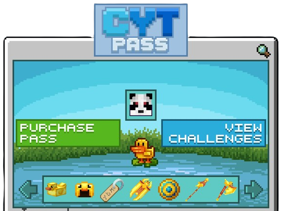

# Pass


In game command: **/pass**


### What is the CYT-Pass?

The CYT-Pass is an in-game battle-pass that has exclusive monthly rewards. The pass is free to earn, however the premium cosmetics do require a purchased pass.

### Earning Pass XP

Pass XP is acquired by simply playing the game!&#x20;

* Breaking/placing blocks
* Killing mobs
* Catching fish
* Being active on the server

There are also weekly challenges that can be completed for a large XP bonus.

Challenge Example

<figure><figcaption>
The April 2024 CYT PASS - Theme - Ducks
</figcaption></figure>

