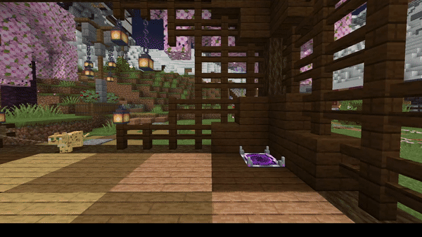

# Teleporters

### What are Teleporters?

Teleporters are a new form of transport that changes how your town memebers get around. Gone are the days of remembering the names to all the outposts and locations your town owns .

### Cost

Teleporters can be unlocked in the CYG recipe book ( **/cyg**) for 15,000XP.

Crafting Recipe

### Using the Teleporters&#x20;

Teleporters are used by simply pressing **Space** while standing on one.

Below is more information on placing and setting up a Teleporter.

* Teleporters must be placed in a town (or nation)
* Teleporters must be in a town for the teleport to work
* Multiple teleporters can go to the same location
* Right click on Teleport A, Then Teleporter B to setup entry/exit points, you have to do this twice if you want to make a back and forth elevator
* Cancel linking by clicking on the same teleporter
* Teleporters can be linked across worlds and have no max range
* Requires towny build permission to place
* Requires towny switch permission to link
* Requires towny item use permission to use

<figure><figcaption>
A  Teleporter being used to travel from a Town Spawn in the Overworld to an Outpost in the Nether
</figcaption></figure>
