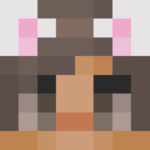

# Staff Team


In-game Command: **/staff**\
Get to know the team by clicking the drop-downs below.


Server Owner(s)

The name more or less says it all. The server would cease to exist without them, they do a lot of work behind the scenes to make sure the server is functioning properly. They also lead the management of the staff team, and are head of all content related decisions.

 **lukemango** - Joined v1 - Founder of CYT - he/him

 **CloverLucyMC** - Joined v9.1 - Co-Owner of CYT - she/her

Manager(s)

Managers are fundamental for the server to run efficiently. They primarily manage the staff team and are heavily involved in high-up cases of moderation. They also play an important role in the production of new content within the server.

**N/A**

Admin(s)

Admins are one of the highest positions within the staff team and they are role-models to the younger staff. They help to manage the staff team, but also take care of moderation themselves. They also are involved in some new content the server has to offer.

 **Am1y** - Joined v7 - Admin for CYT - she/her

 **shawn678** - Joined v7 - Admin for CYT - he/him

 **Lucifer\_Langdon** - Joined v9.10 - Admin for CYT - he/him

Moderator(s)

Moderators are essential in keeping the server safe and fun for everybody. They are key to putting a stop to rule-breakers and player safety is at the forefront of their jobs. You will also find them online a lot as they also engage within the community.

 **Chezzacass** - Joined v9 - Moderator for CYT - any pronouns

 **LordFillern** - Joined v10.1 - Moderator for CYT - he/him

Helper(s)

Helper is the first staff rank within the team, and they are fundamental to ensure that chat is calm and moderated. They are always eager to answer any questions and will be found engaging with the community in any way possible.

 **Gal\_Hectic** - Joined v9.1 - Helper for CYT - he/they

 **Ernestyn** - Joined v9.7 - Helper for CYT - he/him&#x20;

 **deadtrees\_** - Joined v10 - Helper for CYT - any pronouns&#x20;

 **Jayyd\_** - Joined v10 - Helper for CYT - he/they&#x20;

 **anarchictapir** - Joined v10 - Helper for CYT - he/him&#x20;

 **malkum4432** - Joined v9 - Helper for CYT - she/her

### How do I become a Helper?

To join the staff team at CraftYourTown you must meet a number of requirements:

* Minimum **48 hours** of playtime (/pt)
* Minimum **100 days** (or more) with no bans (on CYT)
* Minimum **50 days** (or more) with no mutes or kicks (on CYT)
* Minimum **2 weeks** (or more) with no warnings (on CYT)
* Must have joined at least **30 days ago**
* Not staff on any other Minecraft servers
* Able to play at least 10 hours, 30 minutes per week (split over 5 days)
* Be a known player and active on the server, and involved within the community
* Must have no ongoing conflicts or potential conflicts of interest
* Good availability
* Willing to represent the server and it's values


If you meet these requirements and wish to apply join our **/discord**. You will be able to check if applications are open in the #requirements channel. However, if they are not open, don't worry, as once they are opened again an announcement will be made.


### How do I get into contact with a member of staff?

There are a few ways you can get into contact with one of our staff members;

* you can contact our team by opening a ticket on our /discord server #create-a-ticket.
* you can also /msg \<name> a member of staff if they are visible online.
* you can privately message some of our staff on discord, however we prefer you open a ticket - if they do not respond, please do not badger them.
