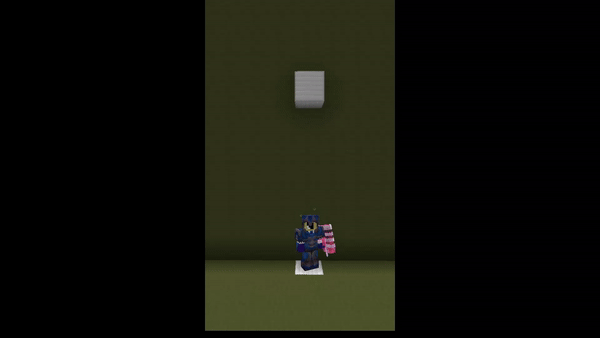

# Miscellaneous

### **Armor Stand Editing**

To get started, place an Armour Stand on the ground and hold a flint in your hand. Look away from the armour stand and right click. In doing so, a GUI is shown that lists a bunch of ways to edit your armour stand.

Some of the key features, such as making the arms visible, removing the base plate and toggling the visibility of the armour stand can be found on the right hand side. In the center, you will find options on which part of the armour stand to move. On the left hand side, you can find premade poses as well as save custom poses for future use. Lastly, on the top row, there are options as to how you want to move the armour stand, using either right or left click. The only limit is your imagination!

If you have multiple armour stands bunched together, and you cannot seem to make the right one move, you can press the key used to toggle between your main and offhand, which will switch which armour stand you are editing!

### **Parkour**

Check out and complete our parkours at `/warp Parkour` daily!

### **Elevators**

Are you tired of using ladders or stairs to get up and down? Worry no more! One of the features of CYT is Elevators! They are very simple to use; place an iron block on one floor, and place an iron block in the same position on another floor, and there you have it! You can place as many iron blocks as you’d like, as long as they’re on top of each other, they will work!

<figure><figcaption>
An elevator in use
</figcaption></figure>
