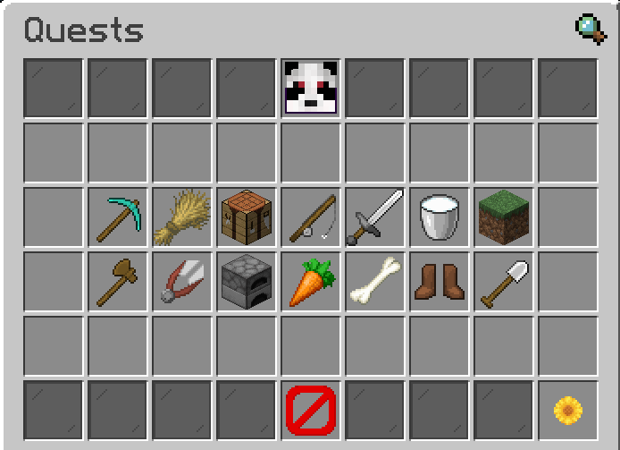

# Quests


**In-game command:** /quests


<figure><figcaption>
The main Quests Category menu
</figcaption></figure>

### What are Quests?

Quests are tasks that you can complete to earn fast cast.\
The amount you can take on at once depends on your current in-game rank, check out `/ranks` to check your current rank.

### Available Commands

* **/quests** - Opens the quests category menu
* **/quest** - List commands
* **/quest list** - Opens the quests category menu
* **/quest list active** - Show your current active quests
* **/quest list cooldown** - Show your quests currently on cooldown
* **/quest list type \<type>**- Open the quests menu for that category
* **/quest quit \<name>** - Quit an active quest
* **/quest start \<name>** - Start a new quest
