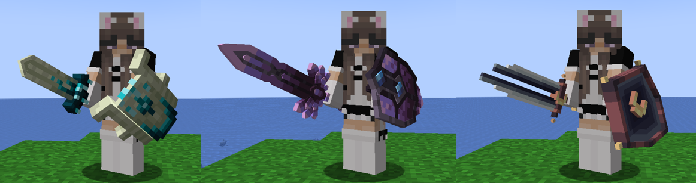

# Skins


In-Game Command: **/skins**


### What are Skins?

One of our features here on CYT is Skins. These you can apply to your tools & armour to make them look extra fancy!

Skins are obtained from crates and server events - they can be applied to tools via the `/skins` menu.

Any skins obtained from Version 11 onwards will cross over into new versions.

<figure><figcaption></figcaption></figure>
