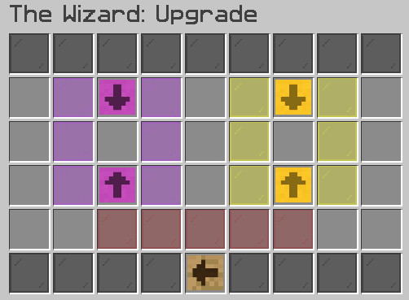

# Wizard


This feature is exclusive to our **Towny** server



In-game command: **/warp Wizard**


## What is the Wizard?

The Wizard is your go-to to upgrade or repair your enchantment books.

### How to use the GUI

<figure><figcaption></figcaption></figure>

To use the above GUI, all you simply need to do is place the book you want to upgrade in the purple slot, hover over the red bar and it'll tell you how many ancient coins you need. If you have enough, put them in the yellow slot and you'll be able to upgrade the enchantment.

To reduce the risk-level of the upgrade failing, you can add more coins - the red/green bar will tell you how many.

### How do I get Ancient Coins?

You can get ancient coins from mining or digging - you don't need to be in the relevant job to get the drops.

You may come across Ancient Coin Fragments, these can be crafted into useable ancient coins via a crafting table.

<figure><figcaption></figcaption></figure>

Enchanted Ancient Coins are an ultra-rare drop (also included in crate & daily rewards) that are a one-time use, guaranteed 100% successful upgrade or repair.

### Enchant Limits

Below are the maximum levels of enchants that are offered on CYT - only obtainable via The Wizard.

* Bane of Arthropods VIII
* Blast Protection VI
* Efficiency X
* Feather Falling VI
* Fire Protection VI
* Fortune V
* Impaling VII
* Knockback IV
* Looting V
* Loyalty V
* Luck of the Sea V
* Lure V
* Piercing VI
* Power VIII
* Projectile Protection VI
* Protection VI
* Quick Charge V
* Sharpness IX
* Smite VIII
* Thorns V
* Unbreaking VI
